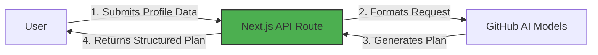

# Step 1: Introduction to StudyPlan App and Environment Setup

> **Summary:**
> In this step, you will set up your development environment with Next.js, ensure all dependencies are installed, and understand the architecture of the StudyPlan project.

## What is StudyPlan?

StudyPlan is a web application that leverages artificial intelligence to generate personalized learning paths for technology professionals. The application processes user inputs such as skill level, available study time, and career objectives to create structured, actionable study plans tailored to individual needs.

### Application Flow

The diagram below illustrates the core interaction flow between components:



### Technical Architecture

The application follows a modern, modular architecture:

- **Frontend**: React with Next.js for server-side rendering and routing
- **Styling**: Tailwind CSS for modern, responsive design
- **Backend**: Next.js API Routes handling HTTP requests
- **AI Integration**: Communication layer with GitHub AI Models for study plan generation
- **Data Flow**: User input is processed through API routes, sent to AI services, and returned as structured educational content

## ⌨️ Activity: Clone Your Lab Repository

Let's create the repository you'll use for your workshop.

1. Navigate to [the repository root](/)
2. Click on the **Fork** button at the top right of the page to create your own copy of the repository.
3. Under **Owner**, select the name of your GitHub handle.
4. Under **Repository**, set the name to **lab-study-app**.

   <details>
      <summary>📸 Show screenshot</summary>
       
   </details>

5. Click **Create fork**. In a few seconds, a copy of the lab repository will be created under your account.

## ⌨️ Activity: Start the App

> This project uses [Dev Containers](https://code.visualstudio.com/docs/devcontainers/containers), which provide a consistent and reproducible development environment. All required dependencies and configurations come pre-installed, so you can start coding right away. You can run the Dev Container locally in your VS Code, or use [GitHub Codespaces](https://github.com/features/codespaces) — a cloud-powered version of VS Code — to work directly from your browser without needing any setup on your machine.

1. Select **Code** > **Create codespace on main**. In a few moments, your codespace will be created.

   <details>
      <summary>📸 Show screenshot</summary>
       
   </details>

2. Validate the **Copilot Chat** extension is installed and enabled.

3. In your Codespace, open the **Copilot Chat** panel and make sure **Ask** mode is selected. This will allow you to ask Copilot questions about the project.

   > 
   >
   > ```prompt
   > How does the StudyPlan app work with Next.js?
   > ```

4. Since you're working in a pre-configured environment, most dependencies should already be available. You can verify by checking the package.json:

    ```bash
    # Check if essential dependencies are available
    cat package.json | grep -E "next|react|tailwind"
    ```

   <details>
      <summary>🖥️ Working locally?</summary>
      
      **For local environment users:**

      If you're setting up the environment on your local machine, follow these steps:

      ```bash
      # Install Node.js dependencies
      npm install

      # Or using yarn
      yarn install

      # Or using pnpm
      pnpm install
      ```
   </details>

5. Verify our application runs before modification. In the terminal, run:

    ```bash
    npm run dev
    ```

   <details>
      <summary>🤔 How it works?</summary><br/>
   
      The `npm run dev` command starts the Next.js development server with hot-reload enabled. This means any changes you make to the code will automatically be reflected in the browser without needing to restart the server.
   </details>

6. In your **Terminal**, use the **Ports** tab to find the webpage address. You'll see port `3000` listed - click the globe icon (🌐) to open the application in your browser or right-click and select "Open in Browser".

     <details>
      <summary>📸 Show screenshot</summary>
       
         
   </details>

> [!TIP]
> Development mode provides hot-reload functionality. You can see changes in real-time as you modify your code, making the development process faster and more interactive.

## ⌨️ Activity: Configure Your GitHub Token

To connect the app with GitHub AI Models, you need to set up a personal access token (PAT). Our application requires authentication to interact with GitHub services securely. The token will enable the StudyPlan AI app to communicate with the AI models that power the study plan generation.

Let's set up your token:

1. **Access**: [GitHub Settings > Personal Access Tokens](https://github.com/settings/tokens)

2. **Create a new classic token** with these settings:
   - Name: `StudyPlan AI Workshop`
   - Expiration: 30 days
   - Scopes: check only `read:user`

3. **Configure the token**: Create a `.env.local` file in the root directory and add your token:

```
GITHUB_TOKEN=your_token_here
```

The `.env.local` file is used to store sensitive configuration values, such as access tokens, and should never be hardcoded in the source code. To keep these secrets safe, the `.env.local` file is already included in `.gitignore`, ensuring it won't be accidentally committed to the repository.

---

[Next: Check your environment →](02-step.md)
